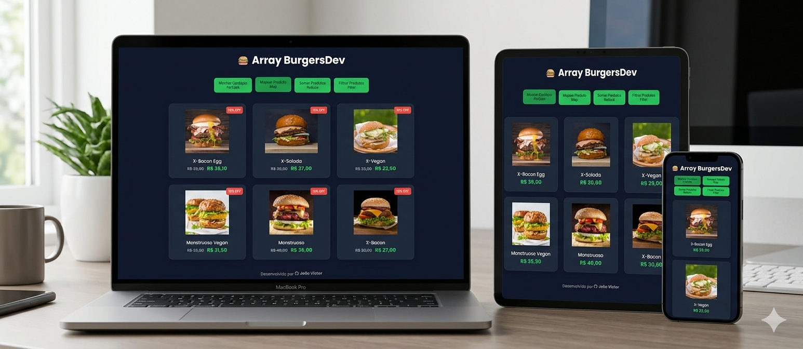

# 🍔 Array BurgersDev

Projeto desenvolvido para praticar **métodos de array em JavaScript** através de um menu interativo de hamburgueres.

O sistema permite mostrar produtos, aplicar descontos, somar valores e filtrar opções veganas utilizando manipulação do DOM.

---

## 🚀 Funcionalidades

✔ Mostrar cardápio usando **forEach**

✔ Aplicar desconto usando **map**

✔ Somar preços usando **reduce**

✔ Filtrar produtos veganos usando **filter**

---

## 🛠 Tecnologias utilizadas

* HTML5
* CSS3
* JavaScript (DOM + Array Methods)

---

## 📷 Preview do Projeto



---

## 🎯 Objetivo do Projeto

Este projeto foi criado para praticar:

* Manipulação do **DOM**
* Métodos de array do **JavaScript**
* Estruturação de projetos **Front-end**
* Criação de interfaces **responsivas**

---

## 📂 Estrutura do Projeto

```
array-burgersdev
│
├── index.html
├── styles.css
├── scripts.js
├── products.js
│
├── img
│   ├── bacon-egg.png
│   ├── xsalada.jpeg
│   ├── xvegan.png
│   ├── monstruoso.png
│   ├── monstruoso-vegan.png
│   └── preview.png
│
└── README.md
```

---

## 💻 Como executar o projeto

1. Clone o repositório

```
git clone https://github.com/JoaoDev-Pro/array-burgersdev.git
```

2. Abra o arquivo **index.html** no navegador.

---

## 👨‍💻 Autor

Desenvolvido por **João Victor**

💼 LinkedIn: https://www.linkedin.com/in/joao-victor-devs/
